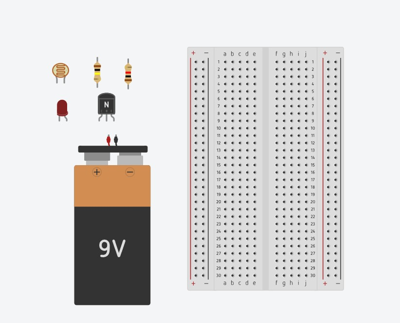
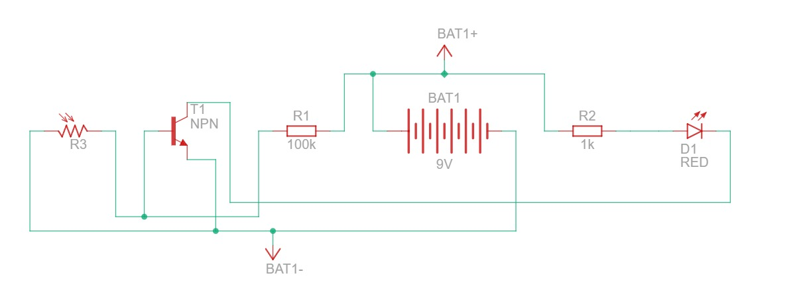
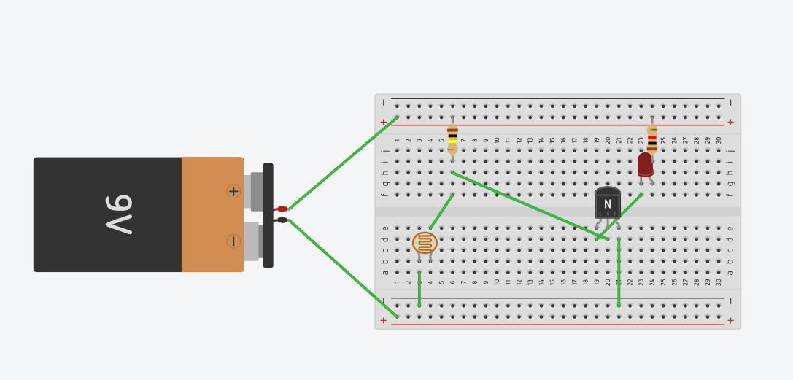
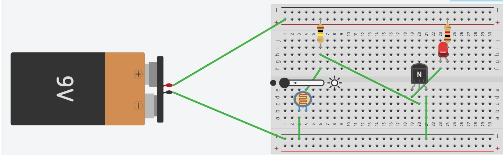
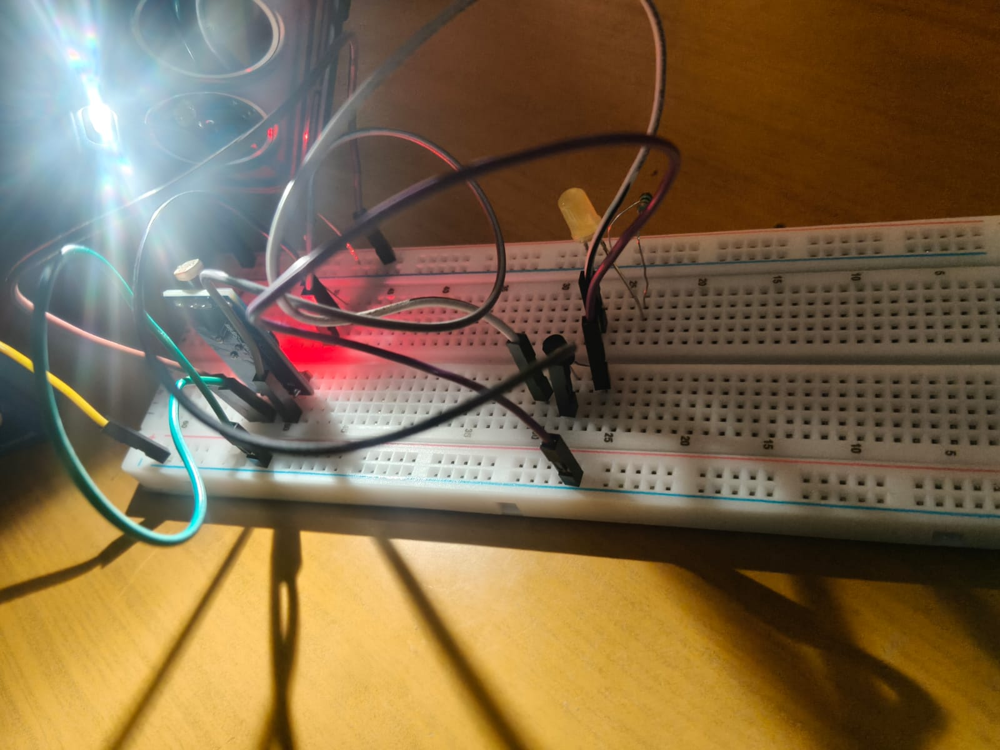
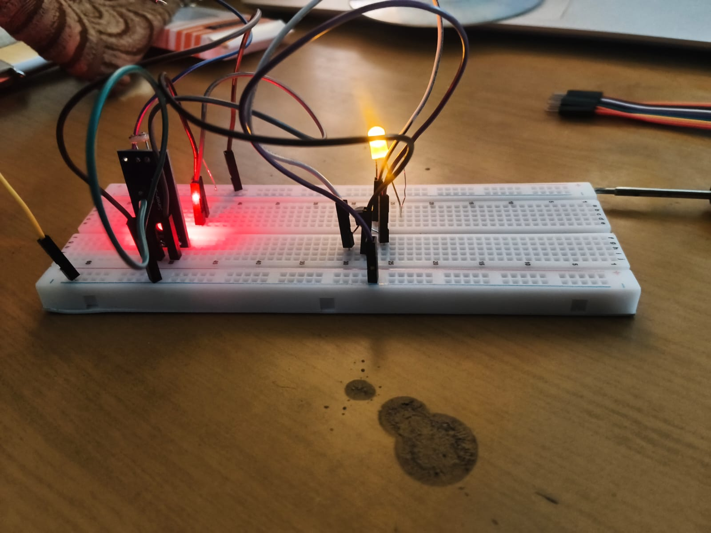

# LDR-Based Automatic Light Control Circuit

# 1\. Introduction

             Automatic lighting systems are designed to control lighting based on the surrounding illumination, reducing the need for manual operation. An LDR (Light Dependent Resistor) is a light-sensitive component whose resistance varies with the intensity of incident light.  
In this project, the LDR is used to sense ambient brightness and control an LED through an NPN transistor. The circuit automatically switches the LED OFF under high brightness and ON under low-light or dark conditions.

2\. Objective  
             To design and demonstrate an LDR-based automatic light control circuit that switches an LED according to the surrounding light intensity.

# 3\. Components Required

* LDR – 1  
* NPN transistor – 1  
* LED – 1  
* Resistors – 1k,100k  
* 9 V battery – 1  
* Breadboard – 1  
* Connecting wires – As required

  

4\. Circuit Schematic  
              The schematic diagram represents the electrical connection and operating arrangement of the LDR, transistor, LED, resistors, and 9 V DC supply.  
   

# 5\. Circuit Assembly

           The circuit was assembled on a breadboard using the components specified above. The LDR acts as the light-sensing element, while the NPN transistor functions as the electronic switching device for the LED.  
Two operating conditions were tested:

1. High ambient brightness  
2. Low ambient brightness / darkness  
   

# 6\. Working Principle

## **6.1 High Ambient Brightness**

                 When the LDR is exposed to high outdoor brightness, its resistance decreases. This causes the transistor to remain OFF, resulting in the LED being switched OFF.  
Bright Light → Transistor OFF → LED OFF  

## **6.2 Low Ambient Brightness / Darkness**

                 When the surrounding light intensity decreases, the resistance of the LDR increases. This causes the transistor to switch ON, allowing current to flow through the LED.  
Low Light/Darkness → Transistor ON → LED ON

# 7\. Experimental Procedure

* Assemble the circuit on the breadboard according to the schematic diagram.  
* Connect the 9 V battery to the circuit.  
* Position the LDR so that it can detect the surrounding illumination.  
* Expose the LDR to bright light and observe the LED.  
* Record the circuit condition and LED state.  
* Reduce the light falling on the LDR or cover it.  
* Observe the LED switching ON automatically.  
* Record the low-light/dark condition.

8\. Results

## **8.1 High Brightness Result**

Under high ambient brightness, the LDR senses strong illumination and the LED remains OFF.  
Result: Bright environment → LED OFF  

## **8.2 Low Brightness / Dark Result**

Under low ambient brightness or darkness, the LDR senses reduced illumination and the LED automatically turns ON.  
Result: Dark environment → LED ON

# 9\. Applications

* Automatic street lighting  
* Automatic night lamps  
* Garden and pathway lighting  
* Security lighting  
* Energy-saving lighting systems  
* Automatic outdoor lighting

10\. Advantages

* Simple and low-cost design  
* Automatic operation  
* No manual switching required  
* Easy to construct and test  
* Suitable for light-sensitive applications.

